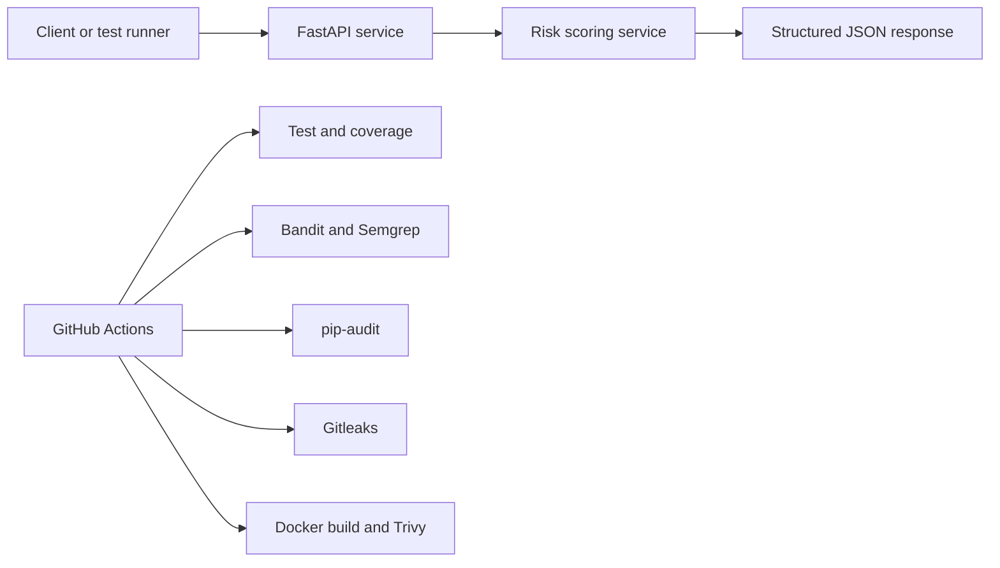

# secure-ci-cd-lab


A portfolio-grade secure CI/CD lab that demonstrates how to combine QA automation, release quality gates, and security controls around a small but real FastAPI service.

## TL;DR

This repository exists to answer a simple question: can a small engineering project demonstrate secure delivery discipline, not just tool familiarity?

- Yes, because it ships a working API instead of a placeholder app.
- Yes, because testing and security controls both feed an explicit release decision.
- Yes, because the repo is optimized for GitHub review, local demo, and interview discussion.

## Portfolio snapshot

| Topic | Summary |
| --- | --- |
| Problem solved | Many CI demo repos stop at build plus unit tests and never define a credible release policy |
| App purpose | FastAPI service that scores release risk for a hypothetical product or service change |
| Tools used | FastAPI, pytest, pytest-cov, Ruff, Bandit, Semgrep, pip-audit, Gitleaks, Trivy, Docker, GitHub Actions, Dependabot |
| Security controls | SAST, dependency scanning, secret scanning, container image scanning, documented severity policy |
| Blocking gates | Failing tests, coverage below 85%, lint errors, vulnerable dependencies, committed secrets, blocking SAST hits, HIGH or CRITICAL image findings |
| Target roles | QA Automation, DevSecOps, Product Security, Platform Engineering, Secure SDLC, SDET |

## What makes this different from a typical CI repo

- It has an actual application surface with validation, business logic, and error handling instead of a toy hello-world endpoint.
- It documents release policy explicitly, including what blocks and what is tolerated.
- It treats tests and security checks as part of the same delivery contract.
- It includes GitHub-friendly static examples and a short local demo path, which makes the repository easier to review quickly.

## Architecture

The application is a FastAPI service that evaluates release risk for a hypothetical internal service. A client sends structured metadata to `POST /analyze`; the API validates the payload, calculates a bounded risk score, and returns a release decision with top risk drivers and recommended actions.

This is intentionally small, but it is large enough to justify:

- unit tests against business logic
- API tests against the HTTP contract
- coverage gating
- static analysis
- dependency auditing
- secret detection
- container image scanning



## Policy gates and severity matrix

### Severity handling

| Severity | Default action | Rationale |
| --- | --- | --- |
| Low | Warn | Useful for hygiene, not strong enough to block this lab by default |
| Medium | Warn or review | Worth triage, but not a default release stop here |
| High | Fail | Strong enough to justify a blocked release |
| Critical | Fail | Always blocking |

### Gate decisions by control

| Control | Tool | Blocking condition | Tolerated findings |
| --- | --- | --- | --- |
| Code quality | Ruff | Any lint error | None |
| Unit and API tests | Pytest | Any failing test | None |
| Coverage | Pytest-Cov | Below 85% | None below threshold |
| SAST | Bandit | High severity with medium/high confidence | Medium and low findings are review items |
| SAST | Semgrep | Any hit from the curated local rules | Only curated high-signal rules are enabled |
| Dependency scan | pip-audit | Any known vulnerable package | None |
| Secret scan | Gitleaks | Any detected secret | None |
| Container scan | Trivy | HIGH or CRITICAL with a fix available | Low/medium findings and unfixed issues are tolerated |

The full policy is documented in [docs/security-policy.md](docs/security-policy.md), and a lightweight visual snapshot lives in [docs/examples/sample-policy-matrix.md](docs/examples/sample-policy-matrix.md).

## Recommended 3-minute demo

1. Open this README and show the "Portfolio snapshot" and gate matrix.
2. Run `make demo` to execute the fast local checks and generate `artifacts/local-controls-summary.md`.
3. Open `.github/workflows/ci.yml` to show that the repo separates tests, SAST, secrets, dependencies, container security, and summary jobs.
4. Open `docs/security-policy.md` to explain why the gates are strict enough to be credible but narrow enough to stay explainable.
5. Finish with `docs/examples/sample-ci-summary.md` and `docs/portfolio-notes.md` to show how the same repo is positioned for GitHub review and interview discussion.

## Representative output examples

These are representative static examples prepared for GitHub presentation:

- [docs/examples/sample-local-run.md](docs/examples/sample-local-run.md)
- [docs/examples/sample-ci-summary.md](docs/examples/sample-ci-summary.md)
- [docs/examples/sample-container-scan-summary.md](docs/examples/sample-container-scan-summary.md)

Example quick demo output:

```text
$ make demo
[ci-local] Running Ruff quality gate
All checks passed!
[ci-local] Running pytest suite with coverage gate
9 passed in 0.91s
[ci-local] Summary written to artifacts/local-controls-summary.md
```

Example API response:

```json
{
  "service_name": "payments-api",
  "risk_score": 81,
  "risk_level": "critical",
  "decision": "block-release",
  "top_risk_drivers": [
    "Service is internet exposed",
    "Service processes personal or sensitive data",
    "High or critical findings remain open"
  ],
  "recommended_actions": [
    "Verify encryption, retention, and access logging for PII workflows.",
    "Place the service behind a WAF or hardened API gateway before release.",
    "Remediate or formally accept high-severity findings before release.",
    "Block release until mitigations are implemented and the pipeline is green."
  ]
}
```

## API overview

### `GET /health`

Returns service liveness, version metadata, and a request identifier.

### `POST /analyze`

Accepts JSON describing a service and returns:

- `risk_score`
- `risk_level`
- `decision`
- `top_risk_drivers`
- `recommended_actions`

Example request:

```json
{
  "service_name": "payments-api",
  "internet_exposed": true,
  "handles_pii": true,
  "has_waf": false,
  "authentication": "sso",
  "data_classification": "confidential",
  "business_criticality": "high",
  "open_findings": [
    { "severity": "medium", "count": 2 },
    { "severity": "high", "count": 1 }
  ]
}
```

## Project structure

```text
secure-ci-cd-lab/
|-- .github/
|   |-- workflows/
|   |   \-- ci.yml
|   \-- dependabot.yml
|-- app/
|   |-- __init__.py
|   |-- logging_utils.py
|   |-- main.py
|   |-- schemas.py
|   \-- service.py
|-- docs/
|   |-- examples/
|   |   |-- README.md
|   |   |-- sample-ci-summary.md
|   |   |-- sample-container-scan-summary.md
|   |   |-- sample-local-run.md
|   |   \-- sample-policy-matrix.md
|   |-- portfolio-notes.md
|   \-- security-policy.md
|-- scripts/
|   |-- demo_walkthrough.sh
|   |-- generate_local_summary.sh
|   |-- run_dependency_scan.sh
|   |-- run_local_checks.sh
|   |-- run_sast.sh
|   |-- run_secret_scan.sh
|   \-- scan_container.sh
|-- tests/
|   |-- conftest.py
|   |-- test_api.py
|   |-- test_health.py
|   \-- test_service.py
|-- .dockerignore
|-- .gitignore
|-- .semgrep.yml
|-- CHANGELOG.md
|-- Dockerfile
|-- LICENSE
|-- Makefile
|-- README.md
|-- pytest.ini
|-- requirements-dev.txt
|-- requirements.txt
\-- ruff.toml
```

Generated local artifacts are written to `artifacts/` and are intentionally not committed.

## Stack

| Area | Choice |
| --- | --- |
| API framework | FastAPI |
| Language | Python 3.11+ |
| Test framework | Pytest |
| Coverage | Pytest-Cov |
| Linting | Ruff |
| SAST | Bandit, Semgrep |
| Dependency scanning | pip-audit |
| Secret scanning | Gitleaks |
| Containerization | Docker |
| Image scanning | Trivy |
| CI/CD | GitHub Actions |
| Dependency updates | Dependabot |

## Local setup

### 1. Create and activate a virtual environment

Linux or macOS:

```bash
python -m venv .venv
source .venv/bin/activate
```

PowerShell:

```powershell
python -m venv .venv
.venv\Scripts\Activate.ps1
```

### 2. Install dependencies

```bash
make install
```

### 3. Run the API

```bash
make run
```

Open `http://127.0.0.1:8000/docs` for the OpenAPI UI.

## Local commands

```bash
make demo
make test
make coverage
make lint
make sast
make depscan
make secrets
make docker-build
make docker-scan
make ci-local
make summary-local
```

### What each command is for

- `make demo`: fast, interview-friendly walkthrough
- `make ci-local`: full local pipeline including security scans
- `make summary-local`: regenerate the local Markdown summary from the latest run
- `make docker-build` and `make docker-scan`: show that image security is part of the delivery flow, not an afterthought

## Static examples for GitHub review

The repository includes representative static artifacts under `docs/examples/` so reviewers can understand the project even when they do not run the toolchain locally.

- `docs/examples/sample-local-run.md`
- `docs/examples/sample-policy-matrix.md`
- `docs/examples/sample-ci-summary.md`
- `docs/examples/sample-container-scan-summary.md`

## How I would explain this in an interview

- I built a small service on purpose so the conversation can focus on delivery quality, security gates, and release policy instead of application complexity.
- The most important part of the repo is not the list of scanners; it is the decision model for what blocks a release and why.
- I made the project easy to demo locally and easy to review on GitHub because real portfolio value depends on communication as much as implementation.

## Limitations and future improvements

- The local shell wrappers assume Bash semantics, so Windows users should prefer Git Bash or WSL for the scripts.
- The repo does not include deployment, signing, SBOM generation, or provenance yet because the current scope is secure CI, not full supply-chain hardening.
- Static analysis and dependency scanning improve coverage, but they do not replace threat modeling or runtime controls.
- Strong next steps would be SBOM generation, image signing, provenance attestation, and a split between PR validation workflows and release workflows.

## Additional portfolio material

- [docs/security-policy.md](docs/security-policy.md)
- [docs/portfolio-notes.md](docs/portfolio-notes.md)
- [CHANGELOG.md](CHANGELOG.md)
